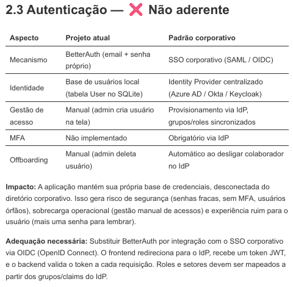
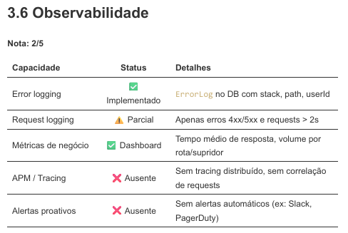

# Projeto: [Hub Request Plan api + front]

## Visão geral
Esse é um projeto nextjs fullstack, vamos precisar dividir o front do backend, vamos começar criando a API separada na pasta, o projeto agora será um monorepo com build independente 

- A api será desenvolvida dentro da pasta : C:\Users\wagner.gomes\RequestHub-api-front\API e deveser totalmente independente, inclusive o build.

## Stack
- APIREST
- TypeScript
- Prisma ORM (com POSTGRES)
- Zod (para validação de todos os dados trafegados)
- BetterAuth para autenticação
- resend para envio de emails
- Docker (Dokcer file da aplicação)

## Estrutura da API 

- dentro da pasta src vamos trabalhar com os seguintes módulos:
    - Routes
    - Controllers
    - Services
    - Pasta lib

Todas a entradas e retornos devem  ser tipadas e validadas com zod

## Atenticação

- Segue abaixo o retorno sobre as alterações de autenticação de deverá ser feita na API :

## Observabilidade

- Sobre observabilidade, segue os popntos que precisamos ajustar na nova API:

- Sobre observabilidade, vamos descartar tudo que foi feito na API anterior e refazer do zero.

- Para observabilidade , vamos usar Grafana, vamos discutir esse ponto.

## Comandos
- `npm run dev` — servidor de desenvolvimento
- `npm run build` — build de produção
- `npm run test` — testes

## Convenções de código
- Componentes em PascalCase, arquivos kebab-case
- Server Components por padrão; usar `"use client"` só quando necessário
- Imports absolutos com alias `@/`
- Sempre tipar retornos de funções exportadas
- Não usar `any`

## Workflow
- Branch principal: `main`
- Sempre criar branch para features: `feat/nome-da-feature`
- Commits no padrão Conventional Commits (`feat:`, `fix:`, `chore:`)

## Regras importantes para o Claude
- NÃO commitar arquivos `.env*` (já estão no `.gitignore`)
- Sempre que criar uma rota nova, adicionar tipagem nos params/searchParams
- Preferir editar arquivos existentes a criar novos
- Se uma tarefa não estiver clara, perguntar antes de codar
- Sempre inserir paginação nas rotas

## 

- Essa task vai criar uma nova função ao software , de gerenciar as travas do planejamento.

- Incluir a model "travas" com a seguinte estrutura:
- 
    trava  string
    area enum ( COMERCIAL | COMPRAS | PLANEJAMENTO | PRICING |FISCAL | OUTRAS)
    solicitacao  string
    aprovadores string
    status enum (ATIVA | INATIVA)
    nome_trava string
    mensagem_customizada string
    motivo_detalhamento sring
    trans_ou_venda enum ( TRANSF | VENDA )
    sales_ou_money usar enum ja existente (Sistema)
    motivo_atualização string
    data_solicitacao createdAt
    data_atualização updatedAt

A model é uma sugestão , entenda a tarefa completa e sugira algo melhor ou mais performático.

- Após criar a model ,criar a estrutura route, controller, service para inserir , editar , buscar e deletar travas e também a função de uplod via CSV

- Na area de admin -> Notificações , criar (front e back ) o campo para cadastrar os emails de quem esta autorizado a editar as travas , todos os demais só poderão consultar

- Na guia inicio , inserir um novo card "Travas | regras " esse card direciona para a nova área de travas ( construir essa área)
-Na área de travas devemosrederizar cards menores para cada area que consta na coluna "area" da tabela do banco ( atualmente 5 ) ao clicar em cada card deverá abrir um modal com a relação de todas as travas pertencentes a essa área apenas com os campos "nome da trava" , "mensage customizada" e "status" com badge e tabém um action button "detalhes" 

- Ao clicar em detahers , deve abrir a "pagina de detalhes da trava" com todas as informações" e um campo de texto , onde as áreas vão poder trocar mensagens assincronas , 
o histórico de mensagens deve apaecer nessa pagina também como um chat , como o none , data , mensagem digitada no campo d texto, perfil de usuario( planejaeto , comercial ...)

- A unida edição que outras pessoas ( que não tem o email cadastrado pelo admin na area de notigicações) poderão fazer nas traas será nesse campo de texto para mensagens assincronas , esse todos podem editar e enviar texto 

abaxo o header e algumas linhas da planilha :

    
